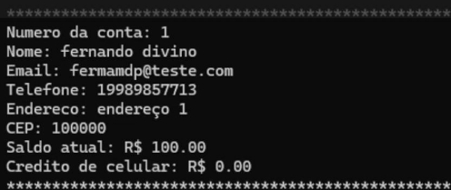

# Projeto Simulador de Caixa Eletrônico

## 💼 Informações sobre o Trabalho

**Faculdade de Tecnologia de Mogi Mirim**

**Curso:** Análise e Desenvolvimento de Sistemas (Noturno)

**Matérias:**
- Linguagem de Programação
- Engenharia de Software I

**Professores:**
- Marcos Roberto Moraes (Maromo)
- Ana Celia Ribeiro Bizigato Portes

**Autores:**
- 👩‍💻 Adryelle Caroline de Souza Calefi
- 👨‍💻 Luis Felipe Piasentini
- 👩‍💻 Tabata Etiele Roberto da Silva
- 👨‍💻 Fernando Divino de Moraes Júnior

## 📚 Índice
- [Visão do Produto](#visao-do-produto)
- [Tecnologias Utilizadas](#tecnologias-utilizadas)
- [Problemas e Soluções](#problemas-e-solucoes)
- [Product Backlog](#product-backlog)
- [Diagrama de Casos de Uso](#diagrama-de-casos-de-uso)
- [Fluxo de Eventos](#fluxo-de-eventos)
  - [Fluxo Básico](#fluxo-basico)
      - [Fluxo Alternativo](#fluxo-alternativo)
- [Diagrama de Atividades](#diagrama-de-atividades)
- [Guia do Usuário](#guia-do-usuario)
- [Conclusão](#conclusao)
- [Licença](#licenca)
- [Agradecimentos](#agradecimentos)

## <a id="visao-do-produto">🌟 Visão do Produto</a>

O **Helpay** é um simulador de caixa eletrônico desenvolvido em C, oferecendo uma interface de linha de comando que emula com precisão as funcionalidades de um caixa eletrônico real. O simulador permite a realização de transações bancárias como saques, depósitos, verificação de saldos, transferências, pagamentos de contas e impressão de extratos, proporcionando uma experiência prática e educativa.

## <a id="tecnologias-utilizadas">🔗 Tecnologias Utilizadas</a>

- Linguagem C
- Visual Studio Code (VSCode)
- MinGW
- CLion

## <a id="problemas-e-solucoes">❓ Problemas e Soluções</a>

### Problema: Interface de Usuário Intuitiva

**Solução:** 
Desenvolvemos uma interface de linha de comando com opções claras e compreensíveis para cada tipo de transação. Mensagens de feedback são utilizadas para orientar os usuários durante todo o processo, garantindo uma experiência positiva e sem complicações.

### Problema: Desenvolver uma Documentação Clara

**Solução:** 
Criamos uma documentação detalhada com tópicos claros para cada aspecto do projeto, incluindo diagramas e explicações simples para garantir que os usuários possam tirar dúvidas e procurar soluções de forma eficiente.

## <a id="product-backlog">📋 Product Backlog</a>

## <a id="diagrama-de-casos-de-uso">📊 Diagrama de Casos de Uso</a>

## <a id="fluxo-de-eventos">🔄 Fluxo de Eventos</a>

### <a id="fluxo-basico">🔀 Fluxo Básico</a>

1. 🟢 O sistema abre o menu de opções.
2. 🔍 O cliente seleciona uma opção verificar dados.
3. ✅ O sistema executa a ação selecionada.
4. 👀 O cliente visualiza seus dados cadastrados.
5. 🟢 O sistema retorna ao menu de opções.
6. 🗑️ O cliente seleciona uma opção excluir dados.
7. 🟢 O sistema abre a aba de exclusão de conta.
8. ❌ O sistema exclui a conta do cliente.
9. 🆕 O sistema solicita a criação de uma nova conta.
10. 🆔 O sistema solicita número da conta.
11. 🧑‍💻 O cliente informa o número da conta.
12. 🧑‍💻 O sistema solicita o nome do cliente.
13. 🧑‍💻 O cliente informa o nome.
14. 📧 O sistema solicita email.
15. 🧑‍💻 O cliente informa o email.
16. 🕵️‍♂️ O sistema verifica os dados.
17. 📞 O sistema solicita o telefone.
18. 🧑‍💻 O cliente informa o telefone.
19. 🕵️‍♂️ O sistema verifica os dados.
20. 🏠 O sistema solicita o endereço.
21. 🧑‍💻 O cliente informa o endereço.
22. 🏢 O sistema solicita o CEP.
23. 🧑‍💻 O cliente informa o CEP.
24. 🕵️‍♂️ O sistema verifica os dados.
25. 🟢 O sistema retorna ao menu de opções.
26. 💰 O cliente seleciona uma opção depósito.
27. 🟢 O sistema abre a aba de depósito.
28. 💸 O sistema solicita o valor a ser depositado.
29. 🧑‍💻 O cliente informa o valor a ser depositado.
30. 🕵️‍♂️ O sistema verifica os dados.
31. 💳 O sistema deposita o valor na conta do cliente.
32. 📈 O sistema retorna o saldo atualizado da conta do cliente.
33. 🟢 O sistema retorna ao menu de opções.
34. 💵 O cliente seleciona uma opção saque.
35. 🟢 O sistema abre a aba de saque.
36. 💸 O sistema solicita o valor a ser sacado.
37. 🧑‍💻 O cliente informa o valor a ser sacado.
38. 🕵️‍♂️ O sistema verifica os dados.
39. 🏦 O sistema verifica se o saldo da conta do cliente é suficiente para realizar o saque.
40. 📈 O sistema retorna o saldo atualizado da conta do cliente.
41. 🟢 O sistema retorna ao menu de opções.
42. 📱 O cliente seleciona uma opção recarga.
43. 🟢 O sistema abre a aba de recarga de celular.
44. 💸 O sistema solicita o valor da recarga.
45. 🧑‍💻 O cliente informa o valor da recarga.
46. 📱 O sistema realiza a recarga do celular.
47. ✅ O sistema retorna uma mensagem de confirmação da recarga.
48. 🟢 O sistema retorna ao menu de opções.
49. 💡 O cliente seleciona uma opção de simulação de empréstimo.
50. 🟢 O sistema abre a aba de simulação de empréstimo.
51. 💸 O sistema solicita o valor do empréstimo, a taxa anual e o tempo em meses.
52. 🧑‍💻 O cliente informa os dados.
53. 📊 O sistema simula o empréstimo e apresenta as informações.
54. 🟢 O sistema retorna ao menu de opções.
55. 📝 O cliente seleciona a opção gerar relatório.
56. 🟢 O sistema abre a aba de geração de relatório.
57. 🔍 O sistema puxa as informações das transações do cliente.
58. 📝 O sistema gera um relatório com as informações.
59. 🟢 O sistema retorna ao menu de opções.
60. 🚪 O cliente seleciona sair.
61. 🧹 O sistema limpa o relatório.
62. 🚪 O sistema sai.

#### <a id="fluxo-alternativo">⚠️ Fluxo Alternativo</a>

- 17a. 📧 O cliente informa um email errado, o sistema retorna mensagem de erro.
- 20a. 📞 O cliente informa um telefone errado, o sistema retorna mensagem de erro.
- 25a. 🏢 O cliente informa um CEP errado, o sistema retorna mensagem de erro.
- 31a. 💸 O cliente informa um valor negativo para depósito, o sistema retorna mensagem de erro.
- 38a. 💸 O cliente informa um valor negativo para saque, o sistema retorna mensagem de erro.

## <a id="diagrama-de-atividades">🛠️ Diagrama de Atividades</a>

## <a id="guia-do-usuario">📝 Guia do Usuário</a>

1. **Visualizar seus dados:**
   - Selecione a opção 1 no menu, “Visualizar Dados”.
   - 
   - Uma aba será aberta mostrando seus dados na tela.
   - 

2. **Excluir Conta:**
   - Selecione a opção "Excluir Conta" no menu.
   - 
   - Uma mensagem de confirmação será exibida após a exclusão.
   - 

3. **Criar uma Conta:**
   - Preencha os dados corretamente ao criar uma conta.
   - 

4. **Erro no Email:**
   - Informe um email válido para evitar erros.
   - 

5. **Erro no Telefone:**
   - Informe um telefone válido para evitar erros.
   - 

6. **Erro no CEP:**
   - Informe um CEP válido para evitar erros.
   - 

7. **Depósito:**
   - Selecione a opção 3, "Depósito" no menu.
   - Informe o valor a ser depositado.
   - 
   - 

8. **Erro no Depósito:**
   - Informe um valor positivo para evitar erros.
   - 

9. **Saque:**
   - Selecione a opção 4, "Saque" no menu.
   - Informe o valor a ser sacado.
   - 
   - 

10. **Erro no Saque:**
    - Informe um valor positivo para evitar erros.
    - 

11. **Gerar Relatório:**
    - Selecione a opção "Gerar Relatório" no menu.
    - 
    - 

12. **Recarga de Celular:**
    - Selecione a opção 6, "Recarga Celular" no menu.
    - Informe o valor que deseja recarregar.
    - 
    - 

13. **Editar Conta:**
    - Selecione a opção 7, "Editar Conta".
    - Escolha o dado que deseja editar.
    - 
    - 

14. **Simular Empréstimo:**
    - Selecione a opção 8, "Simular Empréstimo".
    - Informe o valor do empréstimo, a taxa anual e o prazo.
    - 
    - 
    - 

## <a id="conclusao">✅ Conclusão</a>

O projeto de simulação de caixa eletrônico alcançou seus objetivos, fornecendo uma ferramenta prática e educativa para entender as funcionalidades básicas de um caixa eletrônico. As operações simuladas incluem consulta de saldo, depósito, saque, recarga de celular e simulação de empréstimos, proporcionando uma experiência interativa e realista.

Ressaltamos que o projeto tem caráter didático e não substitui um caixa eletrônico real. As transações simuladas não têm efeito no mundo real e não devem ser usadas para operações bancárias reais.

## <a id="licenca">📜 Licença</a>

Este projeto está licenciado sob a Apache License. Veja o arquivo [LICENSE](./LICENSE) para mais detalhes.

## <a id="agradecimentos">🙏 Agradecimentos</a>

❤️ Obrigado por visitar nosso repositório! Esperamos que você ache nosso projeto útil e interessante.
